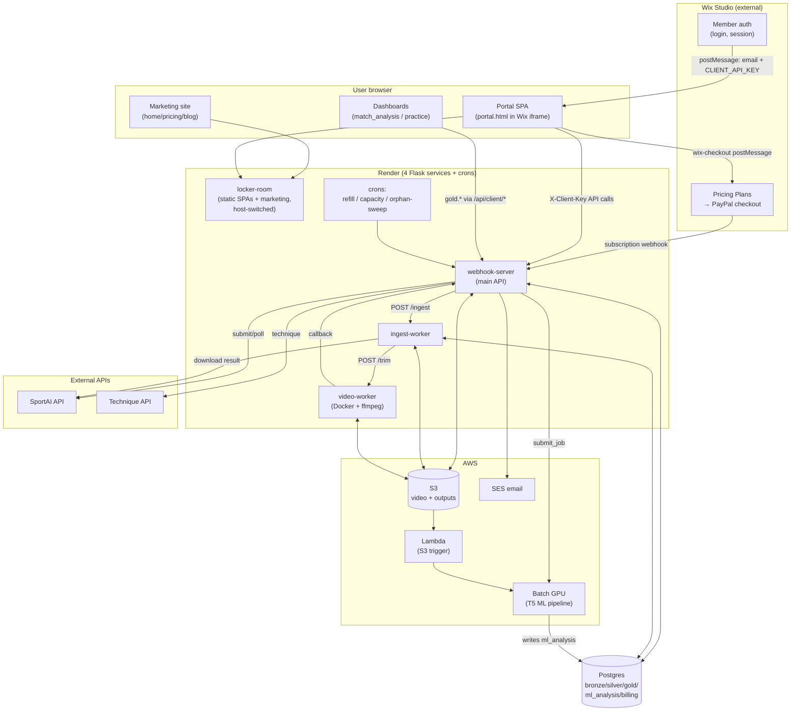
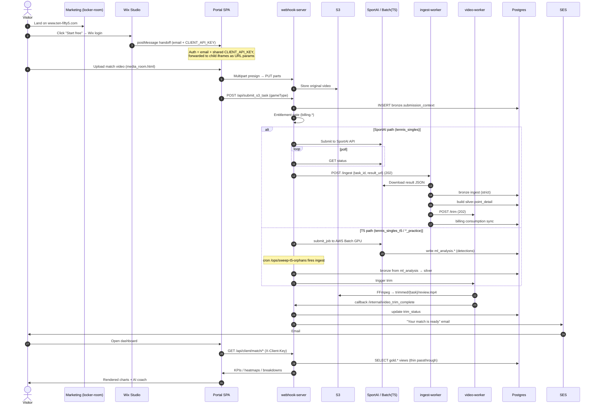

# ARCHITECTURE.md

> **Purpose.** A factual, file-grounded map of how Ten-Fifty5 fits together *today* — before we build the Render-native backend and reduce Wix dependency. Audience: Tomo + future Claude sessions. Companion docs: [`DATA-INVENTORY.md`](DATA-INVENTORY.md) (where data lives + source of truth), [`WIX-DEPENDENCY.md`](WIX-DEPENDENCY.md) (what Wix owns + migration plan).
>
> **Freshness.** Captured 2026-06-16 from code. Line numbers drift — treat file references as the anchor, line numbers as a hint. `render.yaml` + the live code win on any conflict. This is descriptive (what *is*), not prescriptive (what *should be*).

---

## 1. One-paragraph summary

Ten-Fifty5 is an AI tennis-analysis SaaS. A visitor lands on a **native marketing site** (Render), logs in via **Wix Studio** (auth + payment), and is dropped into a **portal** (Render-hosted SPA embedded in a Wix iframe). They upload match video to **S3**, which is analysed either by the external **SportAI API** or our in-house **T5 ML pipeline on AWS Batch GPU**, ingested through a **bronze → silver → gold** medallion pipeline in a single **Postgres** DB, trimmed by a **video worker**, and surfaced as dashboards + an LLM coach. Four Flask services run on Render; AWS (S3, Batch, SES, Lambda) does the heavy lifting; Wix remains the auth + payment front door.

---

## 2. Component inventory

### 2.1 Deployed services (all in `render.yaml`)

| # | Service (render.yaml `name`) | Display name | Type / runtime | Entry point | Start command | Timeout | Role |
|---|---|---|---|---|---|---|---|
| 1 | `webhook-server` | **Sport AI - API call** | `web`, Python 3.12.3, Flask+Gunicorn | `wsgi.py` → `upload_app.py` | `gunicorn wsgi:app … --timeout 1800` | 1800s | Main API: upload presign, sport routing, SportAI submit/poll, T5 Batch submit, ingest orchestration, billing gate, SES notify. Custom domain `api.nextpointtennis.com`. |
| 2 | `ingest-worker` | (same) | `web`, Python 3.12.3, Flask+Gunicorn | `ingest_worker_wsgi.py` → `ingest_worker_app.py` | `gunicorn ingest_worker_app:app … --timeout 3600` | 3600s | Self-contained SportAI ingest pipeline (download → bronze → silver → trim → billing). 1 worker / 2 threads. |
| 3 | `video-worker` | (same) | `web`, **Docker** (`Dockerfile.worker`, python:3.11-slim + ffmpeg) | `video_pipeline/video_worker_wsgi.py` | `gunicorn … --timeout 3600` | 3600s | Stateless FFmpeg trimming. No DB. Spawns detached subprocess, POSTs callback when done. |
| 4 | `locker-room` | **Locker Room** | `web`, Python 3.12.3, Flask+Gunicorn | `locker_room_app.py` | `gunicorn locker_room_app:app … --timeout 120` | 120s | Serves all SPAs from `frontend/` via `send_file()`. **No DB** — data fetched client-side from the main API. Also serves the **public marketing site**, host-switched. Build installs only `flask`+`gunicorn`. |

> **Cross-cutting:** all four share one `DATABASE_URL` (Postgres). Services 1, 2 connect to it; service 4 does not; service 3 is stateless.

### 2.2 Code present but NOT deployed (footguns)

- **`marketing_app.py`** — standalone marketing-only Flask app. **Not wired into `render.yaml`.** The live marketing site is served by `locker_room_app.py` host-switching. Editing `marketing_app.py` ships nothing. Kept as a future "split marketing into its own service" cutover path.
- **`ui_app.py`** — legacy admin UI, registered as a blueprint on the main API at `/upload/*` (OPS_KEY auth). Shell/debug only; the real admin UI is `backoffice.html`.
- **`lambda/ml_trigger.py`** — AWS Lambda source (S3 `ObjectCreated` on `videos/` → submit Batch job). Deployed to AWS Lambda manually, outside Render.

### 2.3 External services

| Service | Used by | Purpose | Auth / config |
|---|---|---|---|
| **Wix Studio** (`info5945780.wixstudio.com/online-tennis-analyt`) | portal, pricing | Member auth, payment checkout (Pricing Plans → PayPal), subscription webhook | Wix-side; see `WIX-DEPENDENCY.md` |
| **SportAI API** (`api.sportai.com`) | `upload_app.py` | External tennis analysis (the `tennis_singles` path) | `Authorization: Bearer SPORT_AI_TOKEN` |
| **AWS S3** | all upload/ingest/trim | Video upload, SportAI/ML outputs, trimmed video, training corpus | `S3_BUCKET`, AWS keys, region |
| **AWS Batch (GPU)** | `upload_app.py` `_t5_submit`, Lambda | T5 ML detection (G5.xlarge A10G primary, G4dn/Spot fallback), regions `eu-north-1` → `us-east-1` | `BATCH_JOB_QUEUE`, `BATCH_JOB_DEF` (Render env, not in `render.yaml`) |
| **AWS SES** (`eu-north-1`) | `coach_invite/` | "Your match is ready" + coach invite emails | `SES_FROM_EMAIL` |
| **AWS Lambda** | S3 trigger | `videos/` upload → Batch job submit | env: `DATABASE_URL`, `BATCH_*`, `S3_BUCKET` |
| **Technique API** (SportAI Technique) | `upload_app.py` `_technique_*` | Biomechanics/pose stroke analysis (`technique_analysis`) | `TECHNIQUE_API_BASE`, `TECHNIQUE_API_TOKEN` |
| **Anthropic / Claude** | `tennis_coach/`, `support_bot/` | LLM coach + FAQ support bot | `ANTHROPIC_API_KEY` |

### 2.4 Database (single Postgres, medallion schemas)

```
bronze.*       raw ingest (SportAI JSON verbatim; T5 facts from ml_analysis)
silver.*       one row per shot (point_detail / practice_detail) — analytical truth
gold.*         thin per-chart/per-widget views — presentation
ml_analysis.*  T5 ML pipeline outputs + job tracking + training corpus
billing.*      accounts, members, entitlements, subscription state, coach permissions
```

Schema is **idempotent, no migration framework** — `bronze_init()`/`gold_init()` + `_ensure_*` functions run on boot; some billing tables created lazily on first webhook/endpoint hit. Full table catalogue → `DATA-INVENTORY.md`.

### 2.5 Cron jobs (Render dashboard, **not** in `render.yaml`)

| Script | Cadence | Fires | Purpose |
|---|---|---|---|
| `cron_monthly_refill.py` | monthly (1st) | `POST /api/billing/cron/monthly_refill` | Refill entitlement credits for active recurring subs (no rollover) |
| `cron_capacity_sweep.py` | every few min | direct Postgres | Mark stuck ingests / trims as failed past staleness timeout |
| `cron_sweep_t5_orphans.py` | every 5 min | `POST /ops/sweep-t5-orphans` (+ `/ops/sweep-sa-orphans`) | Fire ingest for completed-but-unstarted jobs (closes the polling-gate gap) |

---

## 3. How components talk

```
Browser ──HTTPS──> locker-room (static SPAs)         # serves HTML only
Browser ──HTTPS──> webhook-server (main API)         # all data via X-Client-Key
Wix iframe ──postMessage──> portal.html              # auth handoff (email + CLIENT_API_KEY)
Wix ──webhook──> webhook-server                      # POST /api/billing/subscription/event

webhook-server ──HTTP 202──> ingest-worker  (/ingest, Bearer INGEST_WORKER_OPS_KEY)
ingest-worker  ──HTTP 202──> video-worker   (/trim,   Bearer VIDEO_WORKER_OPS_KEY)
video-worker   ──HTTP cb───> webhook-server (/internal/video_trim_complete)

webhook-server ──HTTPS──> SportAI API        (Bearer SPORT_AI_TOKEN)
webhook-server ──boto3──> AWS Batch          (submit_job, region failover)
webhook-server ──boto3──> AWS SES            (completion email)
S3 ObjectCreated ──> Lambda ──boto3──> AWS Batch

ALL of {webhook-server, ingest-worker} ──> Postgres (shared DATABASE_URL)
ALL services ──> S3 (boto3)
```

Key patterns:
- **Fire-and-forget with callbacks.** Main API → ingest worker → video worker are all 202-immediate; state is reconciled via DB columns (`ingest_started_at`/`ingest_finished_at`/`trim_status`) and the video worker's callback. Crons sweep anything that stalls.
- **Worker is deliberately self-contained.** `ingest_worker_app.py` calls `ingest_bronze_strict()` directly and never imports `upload_app.py` (avoids Flask boot side-effects + preserves the 3600s vs 1800s timeout split).
- **Two DB URLs.** Render-internal services use `DATABASE_URL`; AWS Batch jobs (outside Render's network) use `EXTERNAL_DATABASE_URL`. Render Postgres IP-allowlists, so Batch egress must be allowlisted.

---

## 4. System diagram



---

## 5. End-to-end data flow: visitor → dashboard



**Three pipelines, one entry (`POST /api/submit_s3_task`), routed by `sport_type`:**

| `sport_type` | Engine | Path | Output silver |
|---|---|---|---|
| `tennis_singles` | SportAI API | submit → poll → **ingest-worker** → bronze → silver | `silver.point_detail` (`model='sportai'`) |
| `tennis_singles_t5`, `serve_practice`, `rally_practice` | AWS Batch GPU (T5) | Batch → `ml_analysis.*` → sentinel → in-process `_do_ingest_t5` → bronze → silver | `silver.point_detail`/`practice_detail` (`model='t5'`) |
| `technique_analysis` | Technique API | single background thread, end-to-end in `upload_app.py` | `silver.technique_*` |

---

## 6. Top gaps & risks for scaling to a real SaaS

Ranked by how much they'd hurt at scale. Each is observed from code, not speculative.

### 6.1 Security / auth (highest)
1. **No real authentication.** Client API auth is a **single shared `CLIENT_API_KEY`** + an `email` query param (`client_api.py` AUTH guard). Any holder of the key can request any account's data by changing the email. There is no per-user token, session, password, or signature. Auth identity is entirely outsourced to Wix and handed off via `postMessage`. → This is the #1 blocker for being a "real SaaS" and the hardest Wix-decoupling (see `WIX-DEPENDENCY.md`).
2. **Admin allowlist is hardcoded** (`ADMIN_EMAILS` in `client_api.py`) — fine for one operator, doesn't scale to a team.
3. **`CLIENT_API_KEY` lives in Wix Secrets Manager** and is injected into the browser. Rotation requires a Wix-side change; the key is effectively long-lived and broadly scoped.

### 6.2 Privacy / compliance (high — and a stated business concern)
4. **No consent capture, age-gate, or retention/purge logic** anywhere in the repo, despite storing minors' **DOB** (`billing.member.dob`), names, video, and **biometric pose data**. Confirmed (2026-06-16) there is nothing formal today. Processing minors' biometrics without parental consent + a retention policy is a material GDPR/COPPA-class risk. Soft-delete (`deleted_at`) exists but there's no hard-delete / right-to-erasure path. → **Treat as a launch-blocking workstream, not a backlog item.**
5. **PII + video + biometrics in one Postgres + one S3 bucket** with no visible encryption-at-rest config, RLS, or column-level protection in the repo (may exist at the infra layer — unverified).

### 6.3 Single points of failure / operational
6. **Wix is a hard dependency for both auth and payment.** If Wix is down or misconfigured (e.g. Velo handoff breaks), no one can log in or pay. No fallback auth path exists (the 5s URL-param fallback just renders "Configuration Required").
7. **Cron schedules live only in the Render dashboard**, not in `render.yaml` or code. They are undocumented infrastructure — easy to lose on a service rebuild and invisible to code review.
8. **One shared Postgres for everything** (raw video-frame detections in `ml_analysis.*` + billing + PII). T5 detection tables are high-volume; they share capacity with billing/customer-facing queries. No read replica.
9. **`BATCH_JOB_QUEUE` / `BATCH_JOB_DEF` and several secrets are `sync=false`** env vars set only in the Render UI — not reproducible from the repo. Disaster recovery requires Wix + Render + AWS console knowledge that isn't captured anywhere.

### 6.4 Data integrity / correctness
10. **Source-of-truth split across Wix and our DB** (auth identity + subscription state in Wix; everything else in our DB) means reconciliation drift is possible — e.g. a Wix subscription change whose webhook fails leaves `billing.subscription_state` stale (idempotent webhook helps, but there's no periodic reconcile *from* Wix).
11. **No automated test suite** (by deliberate policy — only the `bench` ML regression gate). Billing, auth, and ingest logic have no unit/integration coverage; regressions surface in production against the live DB.

### 6.5 Scaling mechanics
12. **`locker-room` serves marketing + app from one host via host-switching** — couples the marketing site's availability/deploys to the app SPA service. `marketing_app.py` exists as the split path but isn't wired up.
13. **T5 GPU cost + runtime** (~45-min match → tens of minutes of A10G time) is a real per-unit COGS that scales linearly with volume; the "free first match" hook means unbounded free GPU spend without abuse controls.

---

## 7. What we could NOT determine from code

- Wix-side internals: Velo handoff code, Secrets Manager rotation, Pricing Plan definitions (only UUIDs are in our code), PayPal config, what Wix stores about members long-term.
- Infra-layer config not in the repo: Render cron schedules, IP allowlist entries, S3 bucket policy/encryption, Lambda deployment, ECR registry.
- Whether any external analytics/warehouse/support tooling is wired up (none found in this repo).
- The exact `VIDEO_TRIM_CALLBACK_URL` and `WIX_NOTIFY_UPLOAD_COMPLETE_URL` values (secrets); the Wix-notify path appears inactive/legacy.

See `DATA-INVENTORY.md` §"Cannot determine" and `WIX-DEPENDENCY.md` §"Cannot determine" for the full lists.
