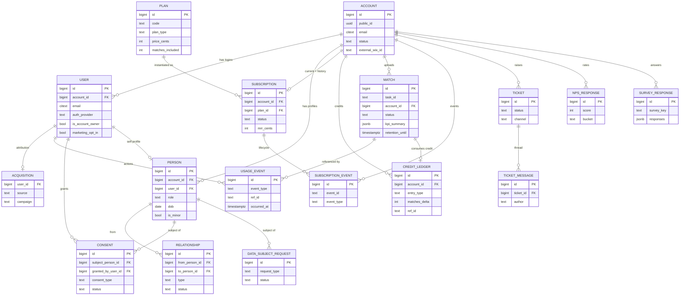

# DB-SCHEMA-PROPOSAL.md  — ⏳ AWAITING APPROVAL (no code written yet)

> **Status:** Proposal for review. Per the task, nothing is implemented until this schema + ER diagram are approved. Builds on [`../architecture.md`](../architecture.md) + [`../architecture.md`](../architecture.md).
>
> **Goal:** make our Postgres the **single source of truth** for customers, subscriptions, matches, usage, relationships, and feedback — with consent/minor/retention modelled as first-class, not bolted on.

---

## 1. Design principles

1. **One canonical schema: `core.*`.** New authoritative home for business entities. The existing `billing.*` and `bronze/silver/gold/ml_analysis.*` are **not** deleted — `billing.*` becomes a legacy projection we backfill-then-deprecate; the medallion analysis layers stay as the analysis SoT and are *linked* (not duplicated) by `core.match` via `task_id`.
2. **No dual source of truth.** During transition `core.*` is built + seeded but **not yet wired as the prod read/write path** (live-data migration is a separate, gated step — §7). We never run `billing.*` and `core.*` as competing sources; we cut over per-entity.
3. **Identity ≠ ownership ≠ profile.** Three entities: `account` (billing container), `user` (login identity — enables the real auth that replaces the shared-key model from `../architecture.md` §6.1), `person` (player/parent/coach profile, may have no login).
4. **Events as an append-only stream** (`usage_event`, `credit_ledger`, `subscription_event`) — easy analytics, natural balances, full audit.
5. **PK strategy:** internal `bigint` identity PKs (matches existing) **plus** a stable `public_id uuid` on externally-exposed entities (account, user, person, match) so APIs never leak enumerable integers and external syncs have a stable key.
6. **Soft-delete + retention everywhere** PII lives (`deleted_at`, `anonymized_at`, `retention_until`).

---

## 2. Schema by domain

### 2.1 Identity & ownership

**`core.account`** — billing/ownership container (supersedes `billing.account`)
| col | type | notes |
|---|---|---|
| id | bigint PK | |
| public_id | uuid | stable external id |
| email | citext UNIQUE | billing/owner contact |
| display_name | text | |
| currency_code | char(3) | default 'USD' |
| status | text | active / suspended / closed |
| external_wix_id | text | sync key (kept for reconcile) |
| created_at / updated_at / deleted_at | timestamptz | |

**`core.user`** — authenticatable login identity (NEW)
| col | type | notes |
|---|---|---|
| id | bigint PK | |
| public_id | uuid | |
| account_id | bigint FK→account | the account this login belongs to (owner + coaches) |
| email | citext UNIQUE | |
| auth_provider | text | clerk / password / google … (legacy: wix) |
| auth_provider_uid | text | e.g. wixMemberId (today's `external_wix_id`) |
| email_verified | bool | |
| is_account_owner | bool | partial-unique: one owner per account |
| marketing_opt_in | bool | quick flag; authoritative consent in `core.consent` |
| status | text | active / disabled |
| last_login_at / created_at / updated_at / deleted_at | timestamptz | |

**`core.acquisition`** — signup attribution, 1:1 with user (NEW)
`user_id FK`, `source`, `medium`, `campaign`, `term`, `content`, `referrer`, `landing_page`, `gclid`, `fbclid`, `first_seen_at`, `signed_up_at`.

**`core.person`** — tennis profile (supersedes `billing.member`)
| col | type | notes |
|---|---|---|
| id | bigint PK | |
| public_id | uuid | |
| account_id | bigint FK→account | |
| user_id | bigint FK→user NULL | linked login; NULL for juniors with no login |
| role | text | **player / parent / coach** |
| is_primary | bool | |
| full_name / surname | text | |
| dob | date NULL | |
| is_minor | bool | derived from dob in views/app (not a generated col — age isn't immutable) |
| utr / dominant_hand / country / area / phone | text | from `billing.member` |
| skill_level / club_school / notes | text | child profile (today's fields) |
| profile_photo_s3_key / profile_photo_url | text | |
| status / created_at / updated_at / deleted_at | | |

**`core.relationship`** — coach↔player, parent↔junior (supersedes `billing.coaches_permission`)
`id`, `from_person_id FK→person`, `to_person_id FK→person`, `type` (coach_player / parent_junior), `status` (pending / active / revoked), `invite_token`, `invited_email`, `created_at/updated_at/revoked_at`. UNIQUE `(from_person_id, to_person_id, type)`.

### 2.2 Subscriptions & billing

**`core.plan`** — plan catalogue (NEW — pulls the hardcoded `frontend/pricing.html` UUIDs into the DB)
`id`, `code` UNIQUE, `name`, `plan_type` (recurring/payg), `price_cents`, `currency`, `billing_interval` (month/year/once), `matches_included`, `techniques_included`, `external_wix_plan_id`, `is_active`, timestamps.

**`core.subscription`** — (supersedes `billing.subscription_state`)
| col | type | notes |
|---|---|---|
| id | bigint PK | |
| account_id | bigint FK→account | |
| plan_id | bigint FK→plan NULL | |
| external_plan_id | text | PayPal Billing-Plan id (legacy: Wix plan UUID) |
| plan_code / plan_type | text | |
| status | text | active / cancelled / expired / past_due |
| billing_provider | text | paypal / stripe / manual (legacy: wix_paypal) |
| **mrr_cents** | int | normalised monthly recurring revenue (0 for payg) |
| current_period_start / current_period_end | timestamptz | |
| started_at / cancelled_at / payment_cancelled_at | timestamptz | |
| matches_per_period | int | |
| created_at / updated_at | | |

Partial UNIQUE `(account_id) WHERE status='active'` (one active sub per account; history kept as extra rows).

**`core.subscription_event`** — webhook audit (supersedes `subscription_event_log`)
`id`, `event_id` UNIQUE (sha256 — idempotency), `account_id`, `subscription_id NULL`, `event_type`, `provider`, `payload jsonb`, `created_at`.

**`core.credit_ledger`** — PAYG + plan credits as an append-only ledger (supersedes `entitlement_grant` + `entitlement_consumption`)
| col | type | notes |
|---|---|---|
| id | bigint PK | |
| account_id | bigint FK→account | |
| entry_type | text | grant / consume / expire / adjustment / refund |
| matches_delta | int | + grant, − consume |
| techniques_delta | int | |
| source | text | subscription / payg_purchase / signup_bonus / manual / match_upload |
| ref_type / ref_id | text | e.g. ('match', task_id) for consume; ('order', order_id) for purchase |
| plan_code | text NULL | |
| external_wix_id | text NULL | idempotency for grants |
| valid_from / valid_to | timestamptz | grant expiry |
| created_at | | |

Idempotency: UNIQUE `(account_id, source, plan_code, external_wix_id)` for grants (mirrors today); UNIQUE `(ref_type, ref_id) WHERE entry_type='consume'` (1 match consumed once — replaces the `task_id` unique). **Balance = SUM(deltas)** → view `core.vw_account_credits` (matches_remaining, techniques_remaining).

### 2.3 Matches / uploads

**`core.match`** — canonical business record for an upload (links to, doesn't replace, bronze/silver/gold)
| col | type | notes |
|---|---|---|
| id | bigint PK | |
| public_id | uuid | |
| task_id | text UNIQUE | bridge to `bronze.submission_context` |
| account_id | bigint FK→account | |
| uploaded_by_user_id | bigint FK→user NULL | |
| subject_person_id | bigint FK→person NULL | whose match it is |
| sport_type | text | tennis_singles / *_practice / technique_analysis |
| pipeline | text | sportai / t5 / technique |
| status | text | uploaded / queued / processing / complete / failed / deleted |
| uploaded_at / processing_started_at / processed_at | timestamptz | |
| match_date / location | | snapshots |
| player_a_name / player_b_name | text | snapshots |
| video_s3_key / trim_s3_key | text | |
| **kpi_summary** | jsonb | cached headline KPIs from `gold.match_kpi` |
| error | text | |
| retention_until / deleted_at / anonymized_at | timestamptz | |
| created_at / updated_at | | |

> `core.match` is the customer/usage/billing view of a match. The frame-level truth stays in `bronze/silver/gold/ml_analysis` keyed by `task_id`. We sync status + KPI summary into `core.match` at ingest completion.

### 2.4 Usage events

**`core.usage_event`** — product analytics stream (NEW)
`id`, `account_id NULL`, `user_id NULL`, `person_id NULL`, `event_type` (match_upload / technique_upload / report_view / ai_coach_query / dashboard_view / login …), `ref_type`, `ref_id`, `metadata jsonb`, `occurred_at`, `created_at`. Indexed `(account_id, occurred_at)`, `(event_type, occurred_at)`. *(High-volume → monthly partitioning noted for later, not v1.)*

### 2.5 Feedback

- **`core.nps_response`** — `id`, `account_id`, `user_id`, `score` (0–10), `bucket` (detractor/passive/promoter, derived), `comment`, `survey_id NULL`, `submitted_at`.
- **`core.survey_response`** — `id`, `account_id`, `user_id`, `survey_key`, `responses jsonb`, `submitted_at`.
- **`core.ticket`** — `id`, `account_id`, `user_id`, `subject`, `body`, `status` (open/pending/resolved/closed), `channel` (support_bot/email/portal), `priority`, `assigned_to`, `created_at/updated_at/resolved_at`. Originates from `support_bot` escalation too.
- **`core.ticket_message`** — `id`, `ticket_id FK`, `author` (customer/agent/bot), `body`, `created_at`.

### 2.6 Consent, privacy & retention (compliance core)

**`core.consent`** — versioned, per-type, per-subject (NEW — this is the heart of §5 of the request)
| col | type | notes |
|---|---|---|
| id | bigint PK | |
| subject_person_id | bigint FK→person | **whose data** (for a minor, the junior) |
| granted_by_user_id | bigint FK→user | **who consented** (the parent, for a minor) |
| consent_type | text | terms_of_service / privacy_policy / marketing_email / **biometric_processing** / **minor_processing_parental** |
| policy_version | text | which version of the policy |
| status | text | granted / withdrawn |
| granted_at / withdrawn_at | timestamptz | |
| source | text | signup / portal / import |
| evidence | jsonb | ip, user-agent, exact checkbox text shown |
| created_at | | |

**`core.data_subject_request`** — GDPR/erasure rights handling (NEW)
`id`, `subject_person_id`, `requested_by_user_id`, `request_type` (access / erasure / rectification / portability), `status` (received / in_progress / completed / rejected), `requested_at`, `completed_at`, `notes`.

**`core.retention_rule`** — configurable retention windows (NEW)
`id`, `data_class` (match_video / biometrics / match_analysis / account_pii / marketing), `retention_days`, `applies_after` (account_closure / upload / consent_withdrawal), `is_active`. A sweep job applies these (sets `retention_until`/`anonymized_at`). Pairs with the existing soft-delete (`deleted_at`).

---

## 3. ER diagram

---

## 4. Mapping: existing → canonical

| Today | Canonical | Migration note |
|---|---|---|
| `billing.account` | `core.account` + `core.user` (owner) | split payer vs login; `external_wix_id` → `user.auth_provider_uid` |
| `billing.member` | `core.person` (+ `core.user` if has login) | role kept; child fields kept |
| `billing.coaches_permission` | `core.relationship` (type=coach_player) | account-level → person-level |
| `billing.subscription_state` | `core.subscription` | + `mrr_cents`, `plan_id`, `billing_provider` |
| `billing.subscription_event_log` | `core.subscription_event` | 1:1 |
| `billing.entitlement_grant` + `entitlement_consumption` | `core.credit_ledger` | two tables → one ledger; balance via view |
| `billing.monthly_refill_log` | (kept, or `credit_ledger` source='subscription') | refill cron rewrites against ledger |
| `bronze.submission_context` | linked by `core.match.task_id` | match business record; bronze stays analysis SoT |
| `gold.match_kpi` | cached into `core.match.kpi_summary` | denormalised summary |
| hardcoded `frontend/pricing.html` plans | `core.plan` | catalogue moves to DB |
| (none today) | `core.usage_event`, `core.consent`, `core.acquisition`, `core.nps_response`, `core.survey_response`, `core.ticket`, `core.data_subject_request`, `core.retention_rule` | net-new |

---

## 5. ⚖️ Legal / privacy decisions needed (flagged, not assumed)

These need a human/legal call before they can be finalised in code:

1. **Biometric special-category basis.** Pose/skeletal keypoints may be "biometric data" under GDPR Art. 9. Processing likely needs **explicit consent** + a documented lawful basis. *Decision: confirm classification + lawful basis wording.*
2. **Age of digital consent.** Varies 13–16 by country. We need an **age gate** and, below threshold, **verifiable parental consent**. *Decision: minimum age + which threshold rule (per-country vs a single conservative 16).* The model supports it (`consent_type='minor_processing_parental'`, `granted_by_user_id`).
3. **Retention periods.** How long to keep video / biometrics / analysis after account closure or consent withdrawal? *Decision: concrete day-counts for `core.retention_rule`.*
4. **Erasure vs financial-record retention.** Tax/accounting may require keeping invoices ~6–7 yrs even after an erasure request. *Decision: confirm we retain billing rows (anonymised) while erasing PII/biometrics.*
5. **Marketing consent = opt-in (explicit), not opt-out** for EU. *Decision: confirm default + double-opt-in?*
6. **Data residency.** EU subjects' video/PII currently spans `us-east-1` (S3) + `eu-north-1` (Batch). *Decision: is EU-only residency required?* (affects S3 bucket + Batch region policy, not just schema).

---

## 6. Data-access / API layer (planned shape — built after approval)

- New package `core_db/` (subdirectory per repo convention): SQLAlchemy models mirroring §2 + `core_init()` idempotent bootstrap.
- A thin **repository layer** (`core_db/repositories/*.py`) — `accounts`, `subscriptions`, `credits`, `matches`, `usage`, `feedback`, `consent` — so the portal/backoffice never write raw SQL. Read paths still go through **gold-style views** for aggregation (keeps the "SQL owns aggregation" rule).
- Blueprint `core_api/` exposing `/api/core/*` (token-auth, replacing the shared-key pattern over time). Backoffice gets `/api/core/admin/*`.
- Seed/test data script: a synthetic account tree (owner + parent + 2 juniors + 1 coach, a subscription, PAYG credits, a few matches with KPI summaries, usage events, an NPS + a ticket, consent records incl. a minor parental-consent + biometric-consent).

## 7. Live-data migration plan (DEFERRED — not run now, per the task)

1. **Build `core.*` empty + DAL + seed** (this implementation step). Prod untouched.
2. **Backfill (dry-run first):** one-off script reads `billing.*`/`bronze.*` → writes `core.*`. Reconcile counts; idempotent + re-runnable.
3. **Dual-write window:** new writes hit `core.*` *and* `billing.*` (or `billing.*` becomes a view over `core.*`) — verify parity before flipping reads.
4. **Cut over reads** (portal/backoffice → `core_api`), per-entity, behind a flag.
5. **Sync external systems → core:** the **PayPal** webhook (`/api/billing/paypal/webhook`, live; Wix as fallback) writes `core.subscription`/`core.credit_ledger` directly via the shared `apply_subscription_event`; add a periodic **reconcile-from-PayPal** job (closes the silent-desync risk in `../architecture.md` §6.4). Identity SoT is already `core.user` (Clerk via `auth_v2`). *(2026-06-16: this is the deferred `core.*` payment mirror — see `STATUS.md` "Not built yet" + `docs/_investigation/core_db_billing_strategy.md`.)*
6. **Deprecate `billing.*`** once parity holds for N days.

---

## 8. Open implementation decisions (need your call — see chat)

A) Build strategy: new `core.*` vs extend `billing.*` in place.
B) Credits model: append-only ledger vs keep grant+consumption.
C) Identity split: full account/user/person vs simpler account+person.
D) PK strategy: bigint+public_uuid vs pure UUID vs bigint-only.
