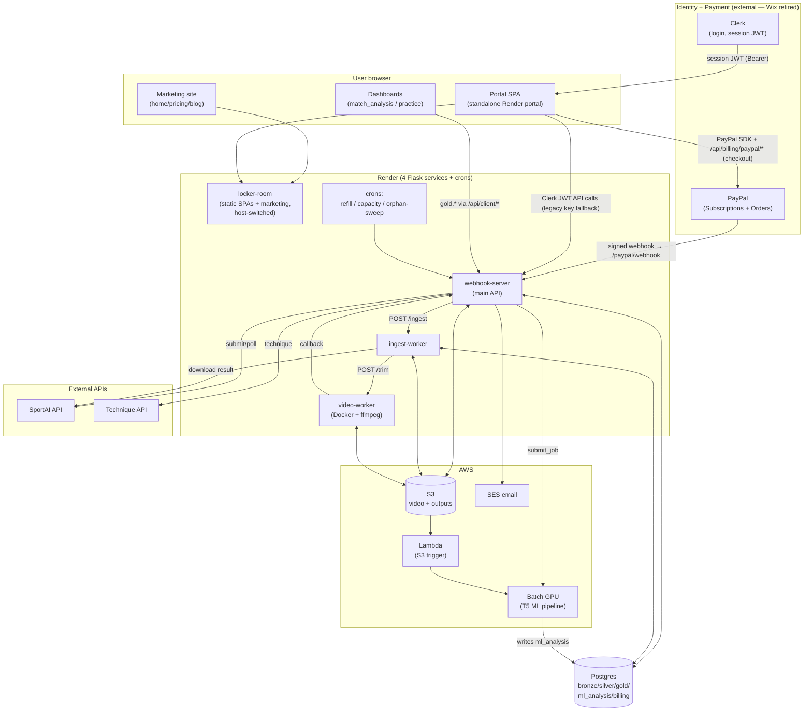

# Architecture & Data

> **Part of the Ten-Fifty5 business documentation set** ([master index](README.md)). This doc merges the system architecture map (`ARCHITECTURE.md`) and the data inventory / source-of-truth catalogue (`DATA-INVENTORY.md`). Excludes the T5 ML pipeline internals (see `docs/north_star.md`).

## Canonical layer / mental model

| Layer | Schema | Owns |
|---|---|---|
| Master/money | `billing.*` | payer identity, entitlements, subscription state, coach perms, payments (new `billing.payment`) |
| Process/raw | `bronze.*` | raw ingest + pipeline state + per-step `task_event` (new) |
| Engagement/graph | `core.*` | account/user/person, `usage_event`, nps/survey, consent, ticket (NOT billing SoR — Option C) |
| Support | `support_bot.*` | chat turns, FAQ KB, cache |
| AI coach | `tennis_coach.*` | coach answers + durable conversations (new) |
| Read-layer | `core.vw_*` in `marketing_crm/backoffice/views.py` | 360 + performance + feedback views; cockpit = presentation |
| CRM out | `marketing_crm/crm_sync` + `contracts/` | push traits+events to Klaviyo/HubSpot + pull API for Cowork |

> **Note (2026-06-17, Option C):** the cockpit reads the `billing.*` system-of-record directly; the deferred `core.*` billing mirror is decided against. See `docs/_investigation/core_db_billing_strategy.md`.
---

# ARCHITECTURE.md

> **Purpose.** A factual, file-grounded map of how Ten-Fifty5 fits together. Audience: Tomo + future Claude sessions. Companion docs: the Data Inventory section below (where data lives + source of truth), [`_archive/wix-migration-record.md`](_archive/wix-migration-record.md) (the now-completed off-Wix migration record).
>
> **Freshness.** Updated 2026-06-17: **Wix is retired** — auth → Clerk, payment → direct PayPal, marketing → native Render (Wix retained only as a rollback path). Originally captured 2026-06-16 from code. Line numbers drift — treat file references as the anchor, line numbers as a hint. `render.yaml` + the live code win on any conflict. Descriptive (what *is*), not prescriptive.

---

## 1. One-paragraph summary

Ten-Fifty5 is an AI tennis-analysis SaaS. A visitor lands on a **native marketing site** (Render), logs in via **Clerk** (identity — `clerk.ten-fifty5.com`, LIVE 2026-06-17), and is dropped into a **standalone Render portal** (no longer a Wix iframe). They upload match video to **S3**, which is analysed either by the external **SportAI API** or our in-house **T5 ML pipeline on AWS Batch GPU**, ingested through a **bronze → silver → gold** medallion pipeline in a single **Postgres** DB, trimmed by a **video worker**, and surfaced as dashboards + an LLM coach. Payment is **direct PayPal** (`paypal_billing/`, LIVE). Four Flask services run on Render; AWS (S3, Batch, SES, Lambda) does the heavy lifting. **Wix is retired** (auth → Clerk, payment → PayPal); only inert data columns + a rollback path remain.

---

## 2. Component inventory

### 2.1 Deployed services (all in `render.yaml`)

| # | Service (render.yaml `name`) | Display name | Type / runtime | Entry point | Start command | Timeout | Role |
|---|---|---|---|---|---|---|---|
| 1 | `webhook-server` | **Sport AI - API call** | `web`, Python 3.12.3, Flask+Gunicorn | `wsgi.py` → `upload_app.py` | `gunicorn wsgi:app … --timeout 1800` | 1800s | Main API: upload presign, sport routing, SportAI submit/poll, T5 Batch submit, ingest orchestration, billing gate, SES notify. Custom domain `api.nextpointtennis.com`. |
| 2 | `ingest-worker` | (same) | `web`, Python 3.12.3, Flask+Gunicorn | `ingest_worker_wsgi.py` → `ingest_worker_app.py` | `gunicorn ingest_worker_app:app … --timeout 3600` | 3600s | Self-contained SportAI ingest pipeline (download → bronze → silver → trim → billing). 1 worker / 2 threads. |
| 3 | `video-worker` | (same) | `web`, **Docker** (`Dockerfile.worker`, python:3.11-slim + ffmpeg) | `video_pipeline/video_worker_wsgi.py` | `gunicorn … --timeout 3600` | 3600s | Stateless FFmpeg trimming. No DB. Spawns detached subprocess, POSTs callback when done. |
| 4 | `locker-room` | **Locker Room** | `web`, Python 3.12.3, Flask+Gunicorn | `locker_room_app.py` | `gunicorn locker_room_app:app … --timeout 120` | 120s | Serves all SPAs from `frontend/` via `send_file()`. **No DB** — data fetched client-side from the main API. Also serves the **public marketing site**, host-switched. Build installs only `flask`+`gunicorn`. |

> **Cross-cutting:** all four share one `DATABASE_URL` (Postgres). Services 1, 2 connect to it; service 4 does not; service 3 is stateless.

### 2.2 Code present but NOT deployed (footguns)

- **`marketing_app.py`** — standalone marketing-only Flask app. **Not wired into `render.yaml`.** The live marketing site is served by `locker_room_app.py` host-switching. Editing `marketing_app.py` ships nothing. Kept as a future "split marketing into its own service" cutover path.
- **`ui_app.py`** — legacy admin UI, registered as a blueprint on the main API at `/upload/*` (OPS_KEY auth). Shell/debug only; the real admin UI is `backoffice.html`.
- **`lambda/ml_trigger.py`** — AWS Lambda source (S3 `ObjectCreated` on `videos/` → submit Batch job). Deployed to AWS Lambda manually, outside Render.

### 2.3 External services

| Service | Used by | Purpose | Auth / config |
|---|---|---|---|
| **Clerk** (`clerk.ten-fifty5.com`) | `/login`, portal, all client APIs | Member auth (per-user JWT, Google + email); verified by `auth_v2/` | `CLERK_PUBLISHABLE_KEY`, `AUTH_ISSUER`, `AUTH_JWKS_URL`; LIVE 2026-06-17 |
| ~~**Wix Studio**~~ (RETIRED 2026-06-17) | — | Was member auth + Pricing Plans checkout + subscription webhook → replaced by Clerk (auth) + PayPal (payment) | Inert; rollback only. See `WIX-DEPENDENCY.md` |
| **SportAI API** (`api.sportai.com`) | `upload_app.py` | External tennis analysis (the `tennis_singles` path) | `Authorization: Bearer SPORT_AI_TOKEN` |
| **AWS S3** | all upload/ingest/trim | Video upload, SportAI/ML outputs, trimmed video, training corpus | `S3_BUCKET`, AWS keys, region |
| **AWS Batch (GPU)** | `upload_app.py` `_t5_submit`, Lambda | T5 ML detection (G5.xlarge A10G primary, G4dn/Spot fallback), regions `eu-north-1` → `us-east-1` | `BATCH_JOB_QUEUE`, `BATCH_JOB_DEF` (Render env, not in `render.yaml`) |
| **AWS SES** (`eu-north-1`) | `coach_invite/` | "Your match is ready" + coach invite emails | `SES_FROM_EMAIL` |
| **AWS Lambda** | S3 trigger | `videos/` upload → Batch job submit | env: `DATABASE_URL`, `BATCH_*`, `S3_BUCKET` |
| **Technique API** (SportAI Technique) | `upload_app.py` `_technique_*` | Biomechanics/pose stroke analysis (`technique_analysis`) | `TECHNIQUE_API_BASE`, `TECHNIQUE_API_TOKEN` |
| **Anthropic / Claude** | `tennis_coach/`, `support_bot/` | LLM coach + FAQ support bot | `ANTHROPIC_API_KEY` |

### 2.4 Database (single Postgres, medallion schemas)

```
bronze.*       raw ingest (SportAI JSON verbatim; T5 facts from ml_analysis)
silver.*       one row per shot (point_detail / practice_detail) — analytical truth
gold.*         thin per-chart/per-widget views — presentation
ml_analysis.*  T5 ML pipeline outputs + job tracking + training corpus
billing.*      accounts, members, entitlements, subscription state, coach permissions
```

Schema is **idempotent, no migration framework** — `bronze_init()`/`gold_init()` + `_ensure_*` functions run on boot; some billing tables created lazily on first webhook/endpoint hit. Full table catalogue → `DATA-INVENTORY.md`.

### 2.5 Cron jobs (Render dashboard, **not** in `render.yaml`)

| Script | Cadence | Fires | Purpose |
|---|---|---|---|
| `cron_monthly_refill.py` | monthly (1st) | `POST /api/billing/cron/monthly_refill` | Refill entitlement credits for active recurring subs (no rollover) |
| `cron_capacity_sweep.py` | every few min | direct Postgres | Mark stuck ingests / trims as failed past staleness timeout |
| `cron_sweep_t5_orphans.py` | every 5 min | `POST /ops/sweep-t5-orphans` (+ `/ops/sweep-sa-orphans`) | Fire ingest for completed-but-unstarted jobs (closes the polling-gate gap) |

---

## 3. How components talk

```
Browser ──HTTPS──> locker-room (static SPAs)         # serves HTML only
Browser ──HTTPS──> webhook-server (main API)         # per-user Clerk JWT (Bearer); legacy X-Client-Key fallback
Clerk ──session JWT──> portal.html                   # login; auth_v2 verifies via Clerk JWKS
PayPal ──webhook──> webhook-server                   # POST /api/billing/paypal/webhook (signature-verified)
# (Wix retired: postMessage handoff + Pricing Plans checkout + /api/billing/subscription/event kept only as rollback)

webhook-server ──HTTP 202──> ingest-worker  (/ingest, Bearer INGEST_WORKER_OPS_KEY)
ingest-worker  ──HTTP 202──> video-worker   (/trim,   Bearer VIDEO_WORKER_OPS_KEY)
video-worker   ──HTTP cb───> webhook-server (/internal/video_trim_complete)

webhook-server ──HTTPS──> SportAI API        (Bearer SPORT_AI_TOKEN)
webhook-server ──boto3──> AWS Batch          (submit_job, region failover)
webhook-server ──boto3──> AWS SES            (completion email)
S3 ObjectCreated ──> Lambda ──boto3──> AWS Batch

ALL of {webhook-server, ingest-worker} ──> Postgres (shared DATABASE_URL)
ALL services ──> S3 (boto3)
```

Key patterns:
- **Fire-and-forget with callbacks.** Main API → ingest worker → video worker are all 202-immediate; state is reconciled via DB columns (`ingest_started_at`/`ingest_finished_at`/`trim_status`) and the video worker's callback. Crons sweep anything that stalls.
- **Worker is deliberately self-contained.** `ingest_worker_app.py` calls `ingest_bronze_strict()` directly and never imports `upload_app.py` (avoids Flask boot side-effects + preserves the 3600s vs 1800s timeout split).
- **Two DB URLs.** Render-internal services use `DATABASE_URL`; AWS Batch jobs (outside Render's network) use `EXTERNAL_DATABASE_URL`. Render Postgres IP-allowlists, so Batch egress must be allowlisted.

---

## 4. System diagram



---

## 5. End-to-end data flow: visitor → dashboard

```mermaid
sequenceDiagram
    autonumber
    actor U as Visitor
    participant MKT as Marketing (locker-room)
    participant CLERK as Clerk
    participant PORTAL as Portal SPA
    participant API as webhook-server
    participant S3 as S3
    participant ENG as SportAI / Batch(T5)
    participant IW as ingest-worker
    participant VW as video-worker
    participant PG as Postgres
    participant SES as SES

    U->>MKT: Land on www.ten-fifty5.com
    U->>CLERK: Click "Start free" → /login (Clerk)
    CLERK->>PORTAL: session JWT
    Note over PORTAL: Auth = per-user Clerk JWT (Bearer), verified by auth_v2;<br/>legacy shared CLIENT_API_KEY remains a fallback (Phase 4 deletes it)

    U->>PORTAL: Upload match video (media_room.html)
    PORTAL->>API: Multipart presign → PUT parts
    API->>S3: Store original video
    PORTAL->>API: POST /api/submit_s3_task (gameType)
    API->>PG: INSERT bronze.submission_context
    API->>API: Entitlement gate (billing.*)

    alt SportAI path (tennis_singles)
        API->>ENG: Submit to SportAI API
        loop poll
            API->>ENG: GET status
        end
        API->>IW: POST /ingest {task_id, result_url} (202)
        IW->>ENG: Download result JSON
        IW->>PG: bronze ingest (strict)
        IW->>PG: build silver.point_detail
        IW->>VW: POST /trim (202)
        IW->>PG: billing consumption sync
    else T5 path (tennis_singles_t5 / *_practice)
        API->>ENG: submit_job to AWS Batch GPU
        ENG->>PG: write ml_analysis.* (detections)
        Note over API: cron /ops/sweep-t5-orphans fires ingest
        API->>PG: bronze from ml_analysis → silver
        API->>VW: trigger trim
    end

    VW->>S3: FFmpeg → trimmed/{task}/review.mp4
    VW->>API: callback /internal/video_trim_complete
    API->>PG: update trim_status
    API->>SES: "Your match is ready" email
    SES->>U: Email

    U->>PORTAL: Open dashboard
    PORTAL->>API: GET /api/client/match/* (X-Client-Key)
    API->>PG: SELECT gold.* views (thin passthrough)
    API->>PORTAL: KPIs / heatmaps / breakdowns
    PORTAL->>U: Rendered charts + AI coach
```

**Three pipelines, one entry (`POST /api/submit_s3_task`), routed by `sport_type`:**

| `sport_type` | Engine | Path | Output silver |
|---|---|---|---|
| `tennis_singles` | SportAI API | submit → poll → **ingest-worker** → bronze → silver | `silver.point_detail` (`model='sportai'`) |
| `tennis_singles_t5`, `serve_practice`, `rally_practice` | AWS Batch GPU (T5) | Batch → `ml_analysis.*` → sentinel → in-process `_do_ingest_t5` → bronze → silver | `silver.point_detail`/`practice_detail` (`model='t5'`) |
| `technique_analysis` | Technique API | single background thread, end-to-end in `upload_app.py` | `silver.technique_*` |

---

## 6. Top gaps & risks for scaling to a real SaaS

Ranked by how much they'd hurt at scale. Each is observed from code, not speculative.

### 6.1 Security / auth (highest)
1. ~~**No real authentication.**~~ **✅ FIXED 2026-06-16/17 (de-Wix auth).** Was: a single shared `CLIENT_API_KEY` + `email` query param (anyone with the key could read any account by changing the email). Now: **per-user Clerk JWT** verified by `auth_v2/` (JWKS), with account + email derived SERVER-SIDE from the token — a spoofed `?email` is ignored. Dual-mode across `client_api`/cockpit/consent/feedback/`support_bot`/`tennis_coach`/`core_api`. The shared `CLIENT_API_KEY` is now a pure fallback (Phase 4 = delete it). See `AUTH-MIGRATION-PLAN.md` + `marketing_crm/STATUS.md`.
2. **Admin allowlist is hardcoded** (`ADMIN_EMAILS` in `client_api.py`) — fine for one operator, doesn't scale to a team.
3. **The legacy `CLIENT_API_KEY` is still a live fallback.** No longer injected via Wix — it's a server-side env var on the Render services, accepted alongside the Clerk JWT until Phase 4 deletes it. While it exists it remains a broadly-scoped shared secret (anyone presenting it + an `?email` is trusted), so Phase 4 (verify no caller depends on it, then remove) is the real close-out of §6.1.

### 6.2 Privacy / compliance (high — and a stated business concern)
4. **No consent capture, age-gate, or retention/purge logic** anywhere in the repo, despite storing minors' **DOB** (`billing.member.dob`), names, video, and **biometric pose data**. Confirmed (2026-06-16) there is nothing formal today. Processing minors' biometrics without parental consent + a retention policy is a material GDPR/COPPA-class risk. Soft-delete (`deleted_at`) exists but there's no hard-delete / right-to-erasure path. → **Treat as a launch-blocking workstream, not a backlog item.**
5. **PII + video + biometrics in one Postgres + one S3 bucket** with no visible encryption-at-rest config, RLS, or column-level protection in the repo (may exist at the infra layer — unverified).

### 6.3 Single points of failure / operational
6. **Auth + payment now depend on Clerk + PayPal (external SaaS); Wix is retired (rollback only).** Login requires Clerk (`auth_v2` verifies its JWT; the legacy `CLIENT_API_KEY` is the only fallback and is still active — Phase 4 deletes it). Payment requires PayPal (`PAYPAL_ENABLED=0` falls back to the retained Wix checkout). A Clerk outage blocks new logins; retiring/rotating the shared key before Phase-4 verification would lock out any client still on it.
7. **Cron schedules live only in the Render dashboard**, not in `render.yaml` or code. They are undocumented infrastructure — easy to lose on a service rebuild and invisible to code review.
8. **One shared Postgres for everything** (raw video-frame detections in `ml_analysis.*` + billing + PII). T5 detection tables are high-volume; they share capacity with billing/customer-facing queries. No read replica.
9. **`BATCH_JOB_QUEUE` / `BATCH_JOB_DEF` and several secrets are `sync=false`** env vars set only in the Render UI — not reproducible from the repo. Disaster recovery requires Clerk + PayPal + Render + AWS console knowledge that isn't captured anywhere.

### 6.4 Data integrity / correctness
10. **Subscription state is webhook-fed with no periodic reconcile.** `billing.subscription_state` is our authoritative copy, written by the PayPal webhook (Wix webhook only as the rollback fallback). A dropped/failed webhook leaves it stale — the signature-verified + idempotent receiver and PayPal's retries help, but there's no periodic reconcile *from* PayPal. (Auth identity now lives in Clerk + `core.user`, not Wix.)
11. **No automated test suite** (by deliberate policy — only the `bench` ML regression gate). Billing, auth, and ingest logic have no unit/integration coverage; regressions surface in production against the live DB.

### 6.5 Scaling mechanics
12. **`locker-room` serves marketing + app from one host via host-switching** — couples the marketing site's availability/deploys to the app SPA service. `marketing_app.py` exists as the split path but isn't wired up.
13. **T5 GPU cost + runtime** (~45-min match → tens of minutes of A10G time) is a real per-unit COGS that scales linearly with volume; the "free first match" hook means unbounded free GPU spend without abuse controls.

---

## 7. What we could NOT determine from code

- **PayPal config is now ours** (`paypal_billing/` + dashboard secrets), not Wix. Remaining external unknowns: Clerk-side config (session-token template, OAuth app); and — only for the retained rollback path — Wix Velo handoff code, Secrets Manager, and the legacy Pricing Plan UUIDs.
- Infra-layer config not in the repo: Render cron schedules, IP allowlist entries, S3 bucket policy/encryption, Lambda deployment, ECR registry.
- Whether any external analytics/warehouse/support tooling is wired up (none found in this repo).
- The exact `VIDEO_TRIM_CALLBACK_URL` and `WIX_NOTIFY_UPLOAD_COMPLETE_URL` values (secrets); the Wix-notify path appears inactive/legacy.

See `DATA-INVENTORY.md` §"Cannot determine" and `WIX-DEPENDENCY.md` §"Cannot determine" for the full lists.

---

# Data Inventory (source-of-truth catalogue)

# DATA-INVENTORY.md

> **Purpose.** Catalogue every place customer / match / subscription data lives today, and **which copy is the source of truth**. Audience: Tomo + future Claude sessions, for planning the Render-native single-source-of-truth migration. Companions: [`ARCHITECTURE.md`](ARCHITECTURE.md), [`_archive/wix-migration-record.md`](_archive/wix-migration-record.md).
>
> **Freshness.** 2026-06-16 from code. Tables marked *(inferred)* were deduced from query usage rather than an explicit `CREATE TABLE` in the files read — verify against the live DB before relying on exact columns. Line numbers drift; file is the anchor.

---

## 1. Where data lives — the short version

| Store | Owner | What's in it | Source of truth for |
|---|---|---|---|
| **Postgres `bronze.*`** | us (Render DB) | Raw SportAI JSON + per-task match context | Match metadata, video location, ingest/trim status |
| **Postgres `silver.*`** | us | One row per shot (analytics) | Point-level analytics, outcomes, serve/return classification |
| **Postgres `gold.*`** | us | Thin per-chart views | Client-facing dashboard shapes (derived only) |
| **Postgres `ml_analysis.*`** | us | T5 detections, job tracking, training corpus | T5 ML facts, GPU job state |
| **Postgres `billing.*`** | us | Accounts, members, entitlements, sub state | Customer profiles, credits/usage, coach links |
| **AWS S3** | us | Uploaded + trimmed video, ML outputs, training labels, profile photos | Video + binary artefacts |
| **Clerk** (external) | Clerk | Login identity, password, session JWT, social/OAuth | **Auth identity** (LIVE 2026-06-17; `auth_v2` verifies the JWT, maps to `core.user`) |
| **PayPal** (direct) | PayPal | Card/payment records, plan catalogue, subscription billing | Payment instruments + charges (we never see these); plan catalogue mirrored in `paypal_billing/catalog.json` |
| ~~**Wix Studio**~~ (RETIRED 2026-06-17) | — | Was auth + Pricing Plans + subscription webhook | **Inert; rollback only** (`PAYPAL_ENABLED=0` / legacy `CLIENT_API_KEY`). See `WIX-DEPENDENCY.md` |

**The split that matters now:** our DB owns *everything about the analysis, the customer profile, billing state, and (since the Clerk cutover) the identity mapping in `core.user`*. The **external front door is Clerk (identity) + PayPal (payment)**; the **authoritative subscription state is our `billing.subscription_state`**, written one-way by the PayPal webhook. Wix is retired (rollback only). See `WIX-DEPENDENCY.md`.

---

## 2. Bronze — raw ingest (`db_init.py`)

| Table | Holds | Notes |
|---|---|---|
| `bronze.raw_result` | JSONB snapshot of SportAI payloads (`payload_json`/`payload_gzip`, sha256) | Verbatim audit copy |
| `bronze.submission_context` | **Per-task orchestration + match metadata** | The master control row — see below |
| `bronze.player` | Per-player metadata (activity score, distance, swing counts, heatmaps) | From SportAI |
| `bronze.player_swing` | One row per swing event (serve flag, swing_type, hit/impact coords, rally bounds) | |
| `bronze.rally` | Rally groupings (start/end/length) | |
| `bronze.ball_position` | Per-frame ball x/y (GENERATED STORED from JSON) | indexed `(task_id, timestamp)` |
| `bronze.ball_bounce` | Bounce events (court_x/y GENERATED, image coords) | |
| `bronze.player_position` | Per-frame player court position | |
| `bronze.session_confidences` | Tracking + court-detection confidence | |
| `bronze.team_session` | Player count + A/B player ids | |
| `bronze.session`, `thumbnail`, `highlight`, `bounce_heatmap` | Registry + assets | |
| `bronze.unmatched_field`, `debug_event` | Unmapped / debug data | |

**`bronze.submission_context` — the load-bearing table.** Source of truth for match metadata + pipeline state. Key columns:
- Customer identity: `email`, `customer_name`
- Match context: `sport_type`, `match_date`, `start_time`, `location`
- Player identity (point-in-time snapshot, **not** linked to `billing.member`): `player_a_name`, `player_b_name`, `player_a_utr`, `player_b_utr`
- Score: `player_{a,b}_set{1,2,3}_games`, `first_server` (`S`/`R`/`player_a`/`player_b` mapping override)
- Video: `s3_bucket`, `s3_key` (original), `trim_output_s3_key`, `video_url`, `share_url`
- Pipeline state: `ingest_started_at`, `ingest_finished_at`, `ingest_error`, `last_status`, `last_result_url`, `session_id`
- Trim: `trim_status` (`queued`/`accepted`/`completed`/`failed`), `trim_requested_at`, `trim_finished_at`, `trim_error`
- Notify: `ses_notified_at`, `ses_notify_error`
- **Soft-delete: `deleted_at`** (workers abort at 4 gates if set; never cascades to `billing.*`)

> **T5 nuance:** for T5, the *true* bronze is `ml_analysis.*`; `build_silver_match_t5.py` Pass 1 projects it into the bronze base facts. SportAI bronze is ingested verbatim from JSON.

---

## 3. Silver — analytical truth (`build_silver_v2.py`)

- **`silver.point_detail`** — one row per shot. Source of truth for point-level analytics. Built by a 5-pass SQL pipeline (insert from `player_swing` → bounce coords → serve/point/game structure + exclusions → zone classification + normalisation → analytics). Key fields: serve zones, rally locations (A–D), stroke type, aggression/depth, outcome (Winner/Error/In), serve try (1st/2nd/Double), ace/DF, `exclude_d` (warmup/replay/gap filter), and a **`model` column (`'sportai'` vs `'t5'`)** so both pipelines coexist in one table.
- **`silver.practice_detail`** — practice equivalent (3-pass, `build_silver_practice.py`).
- **`silver.technique_*`** — technique-analysis silver.

Architectural rule: **silver owns analytics; T5 silver inherits bronze base facts 100% verbatim (hit-driven)**. Don't aggregate in Python/JS if a view can do it.

---

## 4. Gold — presentation views (`gold_init.py`, `db_init.py`)

Thin views, one per chart/widget, aggregating silver into the exact dashboard shape. **Derived only — never a source of truth.** Examples:
- `gold.vw_player`, `gold.vw_point` — base dimension/fact views (player A/B assignment, flattened points)
- `gold.match_kpi`, `gold.match_serve_breakdown`, `gold.match_return_breakdown`, `gold.match_rally_breakdown`, `gold.match_rally_length`, `gold.match_shot_placement`
- `gold.vw_client_match_summary` — client match-list sidebar (filters `deleted_at IS NULL`, `sport_type='tennis_singles'`)

Recreated on every boot (`DROP+CREATE` in one transaction). Consumed by `client_api.py` thin passthroughs + the LLM coach.

---

## 5. `ml_analysis.*` — T5 ML pipeline (`ml_pipeline/db_schema.py`)

| Table | Holds | Source of truth for |
|---|---|---|
| `ml_analysis.video_analysis_jobs` | One row per T5 job: status, stage, video metadata (fps/dims/codec), perf (`ms_per_frame`), court detection, output S3 keys, `batch_job_id`/`arn`, `estimated_cost_usd` | T5 job state + GPU cost tracking |
| `ml_analysis.ball_detections` | Per-frame ball (x/y, court coords, speed, `is_bounce`, `source`) | T5 ball facts |
| `ml_analysis.player_detections` | Per-frame player bbox + center + court coords + `keypoints` (JSONB) + `stroke_class` | T5 player/pose facts |
| `ml_analysis.match_analytics` | Aggregated per-job stats | T5 match aggregates |
| `ml_analysis.training_corpus` | Dual-submit label index (SA↔T5 pairs, label kind, S3 key, counts) | Training-label provenance; UNIQUE `(sa_task_id, t5_task_id, label_kind)` |

> High-volume, frame-level data. Note: Batch direct-writes to `ml_analysis.*` are overwritten by the Render re-ingest (DELETE+COPY from the S3 JSON export) — new bronze facts must be added to **both** the export and the T5 ingest.

---

## 6. `billing.*` — accounts, profiles, money

> Some DDL is created lazily (on first webhook/endpoint); a few tables are *(inferred)* from query usage. Verify columns against live DB.

### Identity
- **`billing.account`** — one per email. `email` (UNIQUE), `primary_full_name`, **`external_wix_id`** (Wix member UUID), `currency_code`, `active`. **Source of truth for the customer account + email↔account mapping.**
- **`billing.member`** — many per account (primary + children + coaches). `full_name`, `role` (`player_parent`/`coach`), `is_primary`, plus profile: `surname`, `phone`, `utr`, `dominant_hand`, `country`, `area`, `profile_photo_url`, and **child fields: `dob` (DATE), `skill_level`, `club_school`, `notes`**. **Source of truth for player/child/coach profile data.** ⚠️ Stores minors' DOB + profile — see compliance risk in `ARCHITECTURE.md` §6.2.

### Entitlements / credits
- **`billing.entitlement_grant`** — credits added (`source`: `wix_subscription`/`wix_payg`/`manual_adjustment`/`signup_bonus`, `matches_granted`, `techniques_granted`, validity). Idempotent UNIQUE `(account_id, source, plan_code, external_wix_id)`.
- **`billing.entitlement_consumption`** — credits used. **One per match, idempotent on `task_id` (UNIQUE).** Source of truth for usage.
- **`billing.vw_customer_usage`** — computed granted/consumed/remaining per account.
- **`billing.entitlements`** *(cache)* — upserted summary on each `/api/entitlements/summary` call (can_upload, block_reason, remaining counts). Derived cache, not truth.

### Subscription state (fed by the PayPal webhook; Wix webhook = rollback)
- **`billing.subscription_state`** *(inferred)* — `account_id` (UNIQUE), `plan_id` (PayPal Billing-Plan id, or legacy Wix UUID), `plan_code`, `plan_type` (`recurring`/`payg`), `matches_granted`, `status` (ACTIVE/CANCELLED/EXPIRED), period dates, **`billing_provider`** (`wix`/`paypal` — the monthly cron refills only `wix`), **`provider_subscription_id`** (PayPal `I-…` for cancel). **Our authoritative copy of subscription state — a one-way mirror written by the PayPal webhook** (see below).
- **`billing.subscription_event_log`** *(inferred)* — audit log of PayPal + Wix webhooks, dedup by `event_id` (sha256).
- **`billing.monthly_refill_log`** *(inferred)* — idempotency for the refill cron, UNIQUE `(account_id, year_month)`.

### Coach access
- **`billing.coaches_permission`** — owner→coach grants (`coach_email`, `status` INVITED/ACCEPTED/REVOKED, `invite_token`). UNIQUE `(owner_account_id, coach_email)`. Token is the auth for accept.

---

## 7. S3 — files & blobs

Bucket = `S3_BUCKET` env (prod: `nextpoint-prod-uploads`); region `AWS_REGION`. Read access via 7-day presigned URLs.

| Content | Key pattern | Tracked in |
|---|---|---|
| Original upload | varies | `bronze.submission_context.s3_key` |
| Trimmed match video | `trimmed/{task_id}/review.mp4` | `submission_context.trim_output_s3_key` |
| Trimmed practice video | `trimmed/{job_id}/practice.mp4` | (practice) — survives original deletion |
| Bronze export JSON | varies | `ml_analysis.video_analysis_jobs.bronze_s3_key` |
| Ball / player heatmaps | varies | `video_analysis_jobs.ball_heatmap_s3_key`, `player_heatmap_s3_keys` (JSONB) |
| Training labels | `training/labels/{t5_task_id}_*.json` | `ml_analysis.training_corpus.label_s3_key` |
| Profile photo | varies (presigned PUT) | `billing.member.profile_photo_url` |

> **Retention note:** original uploads are deleted post-trim (the `s3_key` 404s); the frame-aligned full video survives as `trimmed/<task>/practice.mp4`.

---

## 8. Externally-held data (Clerk / PayPal; Wix retired 2026-06-17)

| Data | Held by | We hold | Sync direction | Truth |
|---|---|---|---|---|
| Login credentials / password | Clerk | ❌ | — | **Clerk** |
| Auth session / JWT | Clerk | verified per-request (`auth_v2`) | Clerk → us (Bearer JWT) | **Clerk** |
| Email | Clerk (login) | `billing.account.email` + `core.user`/`core.account` | Clerk → us (signup + JWT claim) | **Clerk** login master; our copy authoritative for billing |
| First/last name | entered at signup | `billing.member.full_name`/`surname` | user → us | **us** (editable our side) |
| `wixMemberId` | — (legacy) | `billing.account.external_wix_id` | — | **inert** (Wix retired) |
| Plan catalogue (prices, intervals) | PayPal | `paypal_billing/plans.py` + `catalog.json` (live ids) | us → PayPal (catalog script) | **us** — `plans.py` is canonical; legacy Wix UUIDs in `pricing.html` = fallback only |
| Payment / card records | PayPal | ❌ | — | **PayPal** (we never see card data) |
| Full subscription ledger/history | PayPal | current state in `billing.subscription_state` | PayPal → us (webhook) | **PayPal** (full history); our DB = authoritative current state |

Our profile-only fields (UTR, dominant hand, country, children, coach permissions, all match/analysis data) have **no external copy** — we are already the source of truth for those.

---

## 9. Source-of-truth quick map

| Data category | Source of truth | Table(s) |
|---|---|---|
| Auth identity / login | **Clerk** | (external) → mapped to `core.user.auth_provider_uid` |
| Payment | **PayPal (direct)** | (external); catalogue in `paypal_billing/` |
| Current subscription state | **us** (PayPal-webhook-fed) | `billing.subscription_state` |
| Customer account | us | `billing.account` (email UNIQUE) |
| Player/child/coach profile | us | `billing.member` |
| Credits / usage | us | `entitlement_grant` + `entitlement_consumption` (task_id UNIQUE) |
| Coach access | us | `billing.coaches_permission` |
| Match metadata + video location | us | `bronze.submission_context` |
| Point-level analytics | us | `silver.point_detail` |
| Client dashboards | us (derived) | `gold.*` |
| T5 ML facts | us | `ml_analysis.*` |
| Video + binaries | us | S3 |

---

## 10. Sensitive data (PII / minors / financial)

- **PII:** `account.email`, `member.{full_name, surname, phone, profile_photo_url}`, `submission_context.{email, customer_name, player_a_name, player_b_name}`.
- **Minors:** `member.dob`, `skill_level`, `club_school`, `notes` (child profiles) + **video + biometric pose keypoints** (`ml_analysis.player_detections.keypoints`). ⚠️ No consent/age-gate/retention logic in code (confirmed none formal today).
- **Financial:** `entitlement_grant.matches_granted`, `subscription_state.status`+periods, `video_analysis_jobs.estimated_cost_usd`. Card data never touches our systems (PayPal).

---

## 11. Cannot determine from code

1. What Clerk stores internally about members (full identity profile, auth tokens, session/event history).
2. PayPal payment ledger + reconciliation (we hold current subscription state only). Legacy Wix internals matter only for the retained rollback path.
3. Whether any analytics warehouse / CDP / support tool is wired (none found here).
4. SES email *template* content (only trigger points are in-repo).
5. S3 bucket policy, encryption-at-rest, lifecycle rules.
6. GDPR/COPPA retention + erasure process (none in code).
7. Exact DDL for the lazily-created/`(inferred)` billing tables — verify on live DB.
